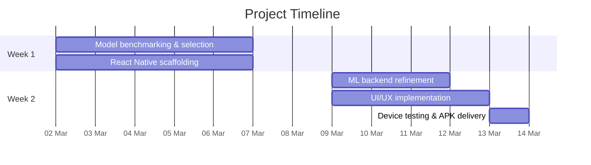

# Project Proposal — Pill Counter Android App

**Prepared for:** Jad Issa
**Date:** February 27, 2026
**Web Demo:** [pill-counting.tabet.tech](https://pill-counting.tabet.tech/)

---

## Overview

A native **Android application** that counts pills in real time — simply **point the camera** at a batch of pills and the count appears instantly, no photo needed. Results include an annotated view with bounding boxes around each detected pill and individual confidence scores.

---

## Deliverables

|                      |                                                            |
| -------------------- | ---------------------------------------------------------- |
| **Android APK**      | Installable on any Android device                          |
| **Docker Image**     | ML inference server for Nvidia Jetson or any remote server |
| **Setup Assistance** | Available to help with deployment if needed                |

---

## App Features

- **Live camera counting** — point and get an instant count, no tap required
- **Image upload** — count from an existing photo in the gallery
- **Annotated result** — bounding boxes, total count, and per-pill confidence scores
- **Pill thumbnails** — individual cropped preview of each detected pill

---

## ML Inference

The model runs in one of three modes — the choice is made after Week 1 testing based on accuracy and speed results.

| Mode                          | Description                                        |
| ----------------------------- | -------------------------------------------------- |
| **Remote API**                | App sends image to a hosted server                 |
| **Nvidia Jetson (Docker)**    | Local inference, offline-capable, low latency      |
| **On-device (TFLite / ONNX)** | Fully offline, runs natively on the Android device |

---

## Timeline — 2 Weeks _(flexible)_

**Week 1 — Model & Inference:** benchmark all three modes, evaluate accuracy and speed, select the best option, scaffold the React Native app.

**Week 2 — App & Backend Polish:** refine the inference pipeline, implement the full UI, test on device, build and deliver the APK.

---

## Pricing

|                                  |            |
| -------------------------------- | ---------- |
| Development (APK + Docker image) | $2,000 CAD |
| 50% on kickoff                   | $1,000 CAD |
| 50% on delivery                  | $1,000 CAD |

**Support:** up to 1 year of bug fixes and maintenance included. New features are a separate project.

---

_Prepared by Charbel Tabet_
