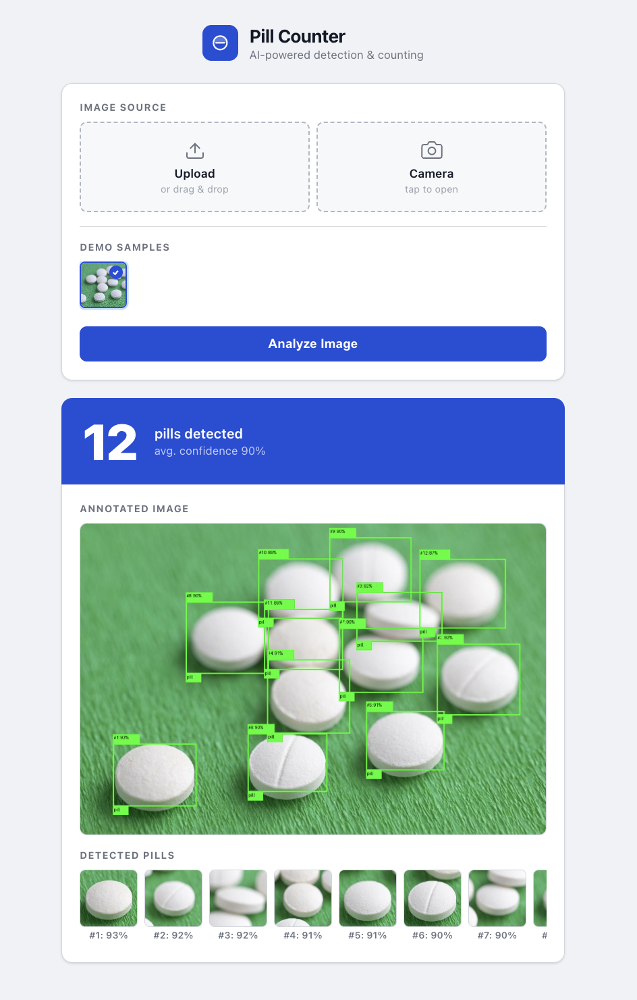
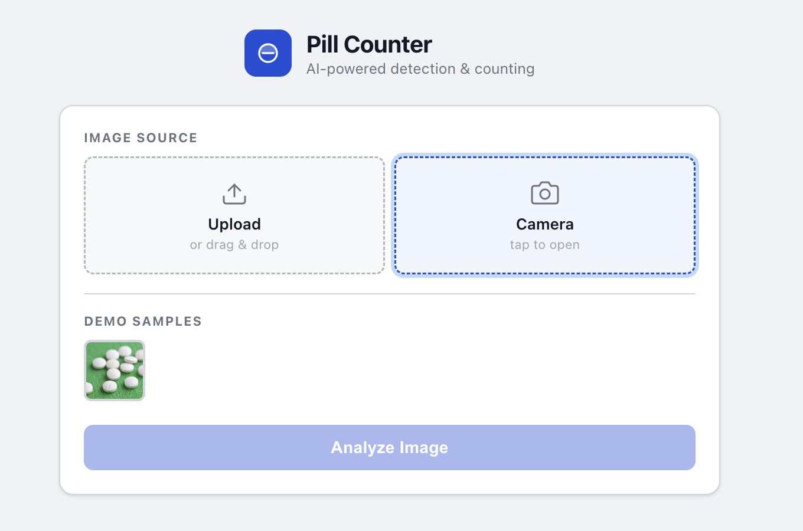
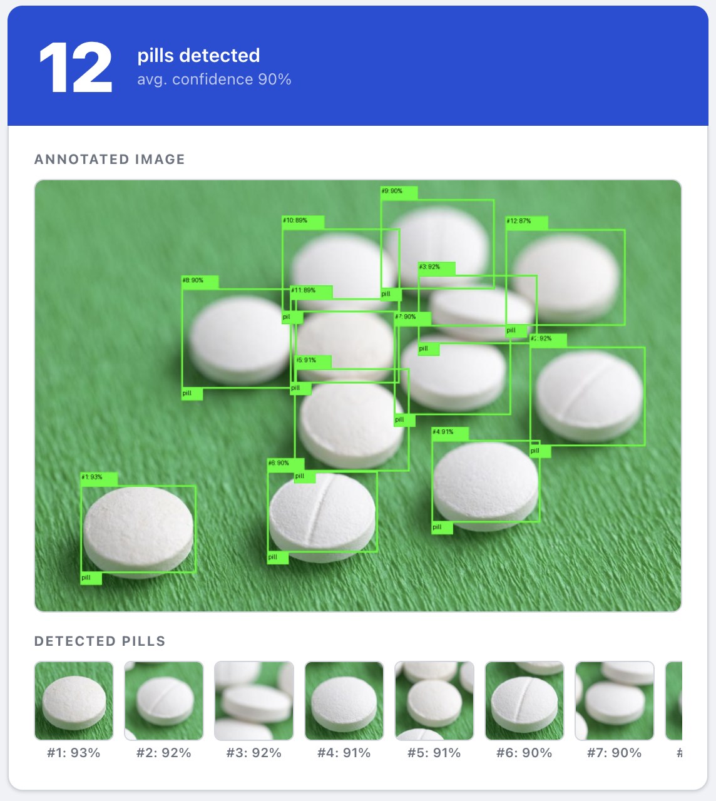
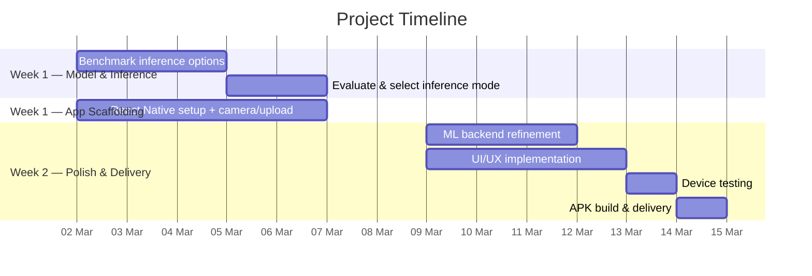

# Project Proposal — Pill Counter Android App

**Prepared for:** Jad Issa
**Date:** February 27, 2026
**Web Demo:** [pill-counting.tabet.tech](https://pill-counting.tabet.tech/)

---

## Overview

_Screenshot of the existing web demo: detected pills highlighted with bounding boxes, total count and confidence displayed prominently._

Design and development of a native **Android application** (APK) for automated pill detection and counting, powered by a machine learning model. The app will allow users to photograph a batch of pills and instantly receive an annotated result showing each detected pill, the total count, and individual confidence scores.

The primary objective: give users a fast, reliable tool to **count pills accurately from a photo**, directly on their Android device or connected to a dedicated inference server.

---

## Deliverables

| Deliverable          | Description                                                                             |
| -------------------- | --------------------------------------------------------------------------------------- |
| **Android APK**      | Production-ready React Native app installable on any Android device                     |
| **Docker Image**     | Self-contained ML inference server, deployable on an Nvidia Jetson or any remote server |
| **Setup Assistance** | I am willing to assist with deployment on Jetson hardware or a remote server if needed  |

---

## App Features

_Phone mockup: left — camera capture screen; right — annotated result with count banner and pill thumbnails._

| Feature            | Description                                                               |
| ------------------ | ------------------------------------------------------------------------- |
| Camera capture     | Rear-facing camera with one-tap capture                                   |
| Image upload       | Select an existing photo from the device gallery                          |
| Annotated result   | Full-resolution image with bounding boxes drawn around each detected pill |
| Count & confidence | Prominent display of total pill count and average confidence score        |
| Pill thumbnails    | Individual cropped pill previews with per-pill confidence scores          |
| Retake / reset     | Easy flow to start a new count                                            |

---

## ML Inference Options

The machine learning model can run in three different modes. The final choice will be made based on the client's satisfaction with the accuracy and speed of each option during Week 1 testing.

| Mode                          | Description                                                                  | Best for                                    |
| ----------------------------- | ---------------------------------------------------------------------------- | ------------------------------------------- |
| **Remote API**                | Inference runs on a hosted server; app sends the image and receives results  | Minimal hardware requirements               |
| **Nvidia Jetson (Docker)**    | Docker image deployed on a local Jetson device; low latency, offline-capable | On-premise / privacy-sensitive environments |
| **On-device (TFLite / ONNX)** | Model exported and runs natively on the Android device; fully offline        | Maximum portability, no server required     |

---

## Team

| Member            | Role      | Responsibilities                             |
| ----------------- | --------- | -------------------------------------------- |
| **Charbel Tabet** | Developer | React Native app, ML integration, deployment |

---

## Timeline

The project is estimated at **2 weeks**. I am flexible on the start date and schedule.

### Week 1 — Model & Inference

Focus on ensuring the ML model performs reliably before building the full app experience.

| Task                        | Description                                                                               |
| --------------------------- | ----------------------------------------------------------------------------------------- |
| Benchmark inference options | Test remote API, Jetson Docker, and on-device TFLite/ONNX across a variety of pill images |
| Evaluate accuracy & speed   | Compare detection rates, false positives, and latency for each option                     |
| Select inference mode       | Agree with client on the best deployment mode based on results                            |
| Initial app scaffolding     | Set up React Native project, camera, and image upload                                     |

### Week 2 — App & Backend Polish

Focus on delivering a smooth, production-quality application.

| Task                  | Description                                                             |
| --------------------- | ----------------------------------------------------------------------- |
| ML backend refinement | Fine-tune inference pipeline, error handling, and result formatting     |
| UI/UX implementation  | Annotated image display, count banner, pill thumbnails, navigation flow |
| Testing on device     | End-to-end testing on physical Android hardware                         |
| APK build & delivery  | Sign and package the final APK for distribution                         |

---

## Communication

|              | Detail                                                  |
| ------------ | ------------------------------------------------------- |
| **Updates**  | Regular progress updates with screenshots and questions |
| **Meetings** | Available daily for feedback and adjustments            |
| **Duration** | 2 weeks (flexible start date)                           |

---

## Support

Upon delivery, I include **up to 1 year of support** covering bug fixes and maintenance of existing features. New features or significant changes to scope are considered a separate project.

---

## Pricing

| Description                                            | Amount         |
| ------------------------------------------------------ | -------------- |
| Android APK (React Native development, ML integration) | —              |
| Docker inference image (Jetson / remote server)        | —              |
| **Total**                                              | **$2,000 CAD** |

### Payment Terms

| Milestone                 | Percentage | Amount     |
| ------------------------- | ---------- | ---------- |
| Project kickoff (upfront) | 50%        | $1,000 CAD |
| Final delivery            | 50%        | $1,000 CAD |

---

_Prepared by Charbel Tabet_
